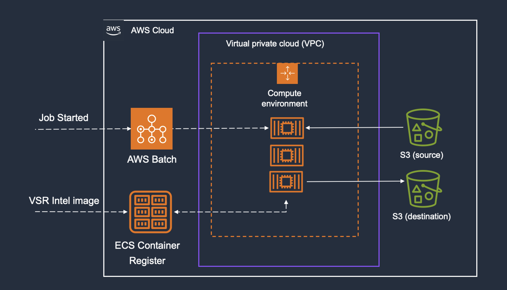

# AWS Batch Video Super-Resolution powered by the Intel® Library for Video Super Resolution

<!--TOC-->

- [Introduction](#introduction)
- [Disclaimer And Data Privacy Notice](#disclaimer-and-data-privacy-notice)
- [Architecture](#architecture)
- [Deploy the solution with AWS Cloudformation](#deploy-using-cloudformation)
- [Extend the solution](#extend-the-solution)
- [Cost](#cost)
- [Clean up](#clean-up)
- [References](#References)

<!--TOC-->

## Introduction
Implementing Super-resolution based on the enhanced RAISR algorithm utilizing Intel AVX-512 requires AWS-specific instance types, such as c5.2xlarge, c6i.2xlarge, and c7i.2xlarge. We leverage [AWS Batch](https://aws.amazon.com/batch/) to compute jobs and automate the entire pipeline rather than dealing with all the underlying infrastructure, including start and stop instances. We also automate the ingress and egress workflow to trigger each job based on an S3 bucket event. Therefore,  AWS customers interested in using the benefits of the enhanced RAISR algorithm for super-resolution can continue focusing on the ABR transcoding pipeline and adapt their existing workflow to leverage AWS Batch as a preprocessing stage.
The first step is to create a compute environment in AWS Batch, where CPU requirements are defined, including the type of EC2 instance allowed. The second step regards creating a job queue associated with the proper computing environment. Each job submitted in this queue will be executed using the specific EC2 instances. The third step involves the definition of a job. At this point, it is necessary to have a container registered in the AWS Elastic Container Register [ECR](https://aws.amazon.com/ecs/). Building the container is further detailed in section [Extend the solution](#extend-the-solution). The container includes installing the Intel Library for VSR, open-source ffmpeg tool, and AWS CLI to perform API calls to S3 buckets. Once the job is properly defined (image registered in ECR), Jobs can start being submitted into the queue.

## Disclaimer And Data Privacy Notice

When you deploy this solution, scripts will download different packages with different licenses from various sources. These sources are not controlled by the developer of this script. Additionally, this script can create a non-free and un-redistributable binary. By deploying and using this solution, you are fully aware of this.

## Architecture

## Deploy using cloudformation
Bellow are described the steps to deploy the proposed solution:
1. Download [template.yml](https://github.com/aws-samples/video-super-resolution-tool/blob/main/template.yml)
### Extend the solution 

Building your container container

## Cost

AWS Batch optimizes compute costs by paying only for used resources. Using Spot instances leverages unused EC2 capacity for significant savings over On-Demand instances. Benchmark different instance types and sizes to find the optimal workload configuration. Test options like GPU versus CPU to balance performance and cost.

## Clean up

To prevent unwanted charges after evaluating this solution, delete created resources by:

1. Delete all objects in the Amazon S3 bucket used for testing. I can remove these objects from the S3 console by selecting all objects and clicking "Delete."
2. Destroy the AWS CDK stack that was deployed for testing. To do this, I open a terminal in the Git repository and run: `task cdk:destroy`
3. Verify that all resources have been removed by checking the AWS console. This ensures no resources are accidentally left running, which would lead to unexpected charges.

## References
1. [Intel® Library for Video Super Resolution](https://github.com/OpenVisualCloud/Video-Super-Resolution-Library)
2. [ffmpeg](https://ffmpeg.org)
3. [Whitepaper short-version](https://dl.acm.org/doi/10.1145/3638036.3640290)
4. [Whitepaper long-version] (https://www.intel.com/content/www/us/en/content-details/820769/aws-compute-video-super-resolution-powered-by-the-intel-library-for-video-super-resolution.html)

## Security

See [CONTRIBUTING](CONTRIBUTING.md#security-issue-notifications) for more information.

## License

This library is licensed under the MIT-0 License. See the LICENSE file.

